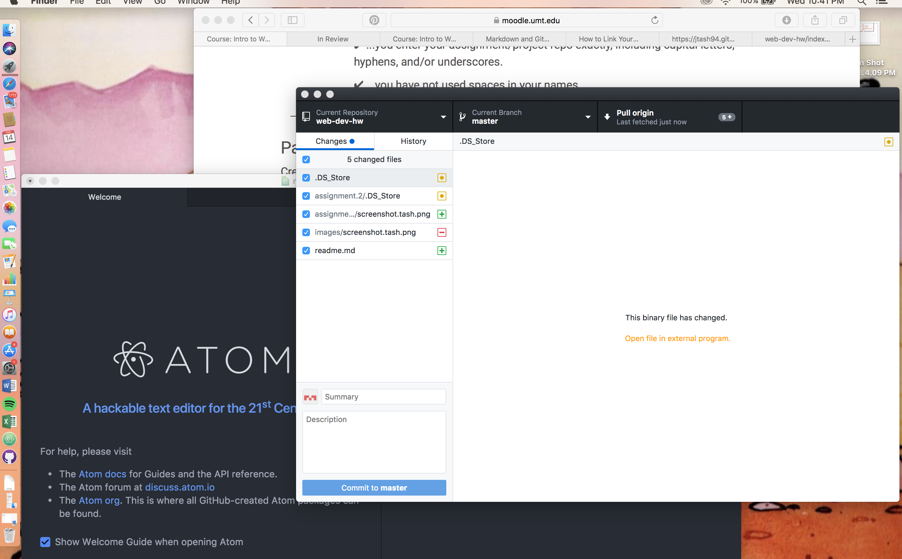

<html>
<h1> Technical Report Project 1</h1>
<body>

1. A browser functions by compiling CSS and HTML documents  
and organizing them for interactive user experiences,  
I use Safari on my phone and laptop currently, but I've  
used Chrome in the past and I tend to prefer it. Not a huge   fan of Firefox, but it's better than explorer.
2. I looked at the OG NYT website. It was much more   simple and straightforward than today's site, with much less   to interact with on the homepage. Today's is much   more user-friendly, more attractive, and with more directories for users.
3. I start off reading/watching all the week's materials, then start my own project. I'm still having some difficulties with GitHub, namely that I know I don't 100% understand what's happening with it in general so it's difficult to self-troubleshoot. Embedding the image was the hardest part, as it just wasn't showing up, but eventually it just worked and I'm still not entirely sure why it wasn't previously.

</body>
</html>
