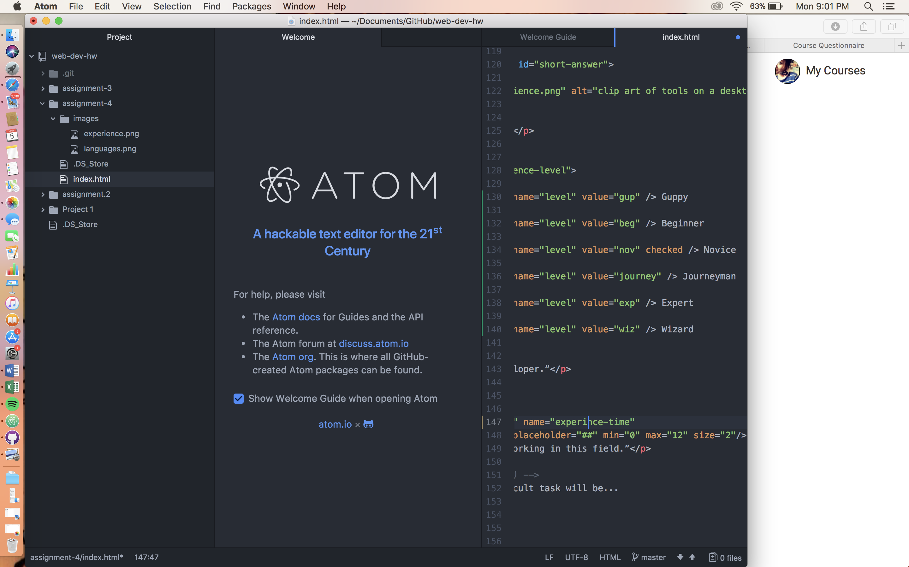

<h1>Readme.md Assignment 4</h1>
<body>

Alt text is used so that people with visual impairments can still understand what's going on in a webpage via text-to-speech, or to give users a sense of a photo if the image itself is broken.

 Forms are most often used in my browsing for shipping and billing information-gathering in online checkouts. They make it possible to check out on the webpage itself instead of having to use a separate form and submitting it manually.

 My work cycle differed a bit this week in that I quickly read through all the directions, went to the website and combed through the module, and then went step-by-step through the instructions and using relevant module entries alongside each step. I'm still having issues adding images from time to time; sometimes the img src is all correct, but it still isn't working, so that's frustrating. Otherwise, I thought this assignment was pretty smooth sailing. Any issues I had just ended up being typos, so I just need to pay closer attention while I'm typing everything out.

</body>
