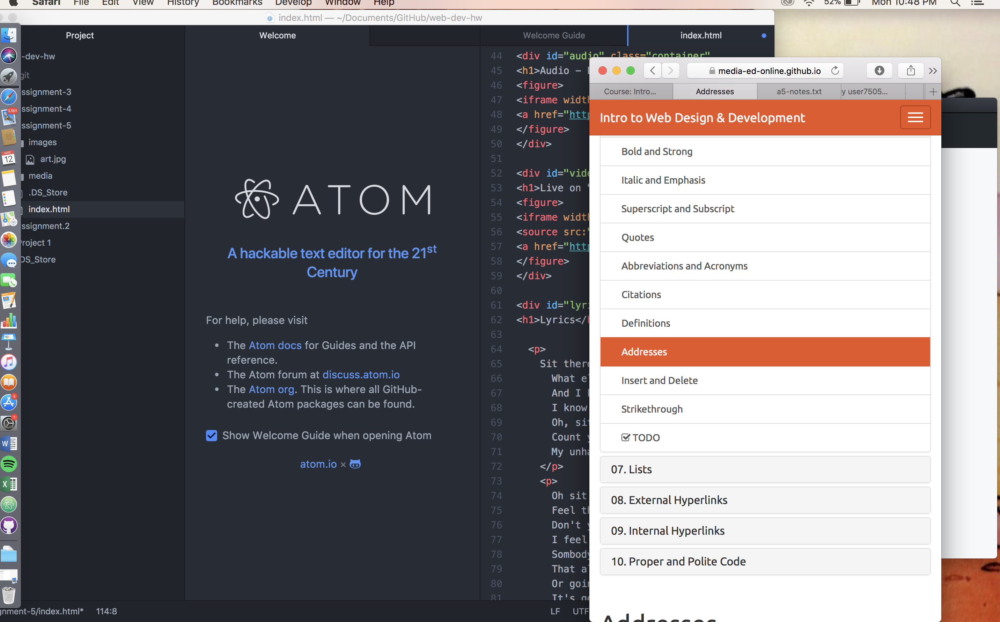

<!DOCTYPE html>
<html>

<h1>Readme.md</h1>

1. A div is a way to classify paragraphs so that stylesheets can be easily applied to certain blocks of text/other media and not others. It also keeps all blocks of media connected, appearing one right after the other.   A class groups similar things together within the div so that styling is even easier within that specific tag.   An ID keeps one specific element separate from the others, as it is not to be repeated.   Span tags help certain words or phrases stand out in some way.

2.  I had some trouble with linking, once again; namely. I was initially confused about whether or not you need both <video> and <iframe> elements, since my videos weren't working.  I started by outlining my index with each of the div tags and the main required elements, put all media in corresponding folders, and followed directions in order, filling in the blank spaces.  

3. Third-party media is less likely to take up undue space on one's computer, since it doesn't need to be downloaded. It's also easy to find premade embedding links, saving a bit of a headache.

