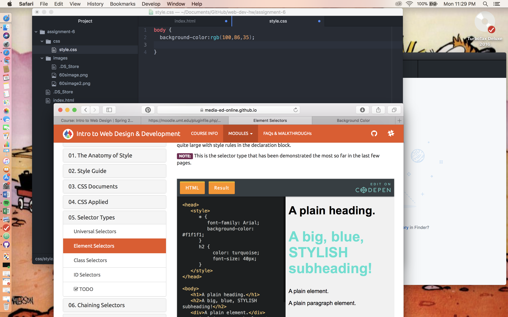

<!DOCTYPE html>
<html>

<h1>Assignment-6 Readme.md</h1>
 

1. I chose the abstract design clip art-y pieces from the 1960's folder.  I tried to style my page in a mod-inspired layered way with muted colors common during the decade .  I also used the opacity elements for a pop-art look. 

 

2. I chose burgundy rgb(128,0,32), mustard rgb (227, 190, 66) and pale pink (255,192,203),   since they were all popular in fashion/interior design in the 60s and complement each  other well.

  
 
3. I started with reading and watching the materials and then started my own project,  which was smooth sailing until it came to cascading. I managed to figure it out, but pretty much  just fiddled with things for the majority of the time  until it clicked.

 
