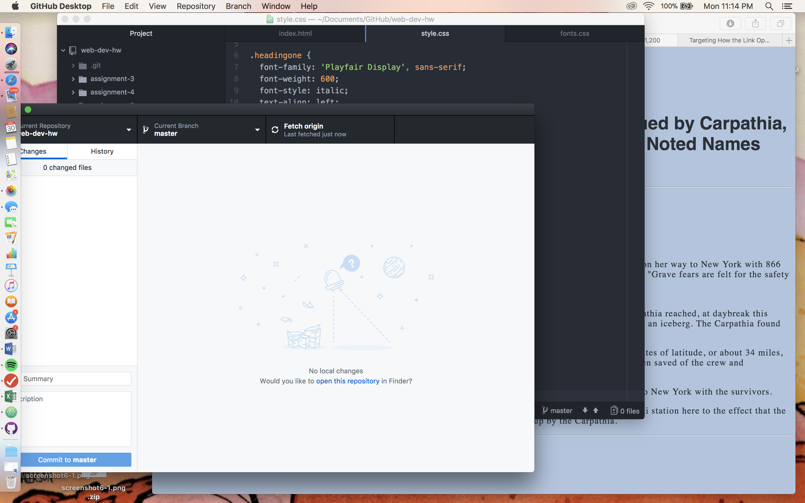

<!DOCTYPE html>
<html>

<h1>Assignment 7 Readme </h1>
 

1. I chose Playfair Display and Noto Serif, both with serifs. I did so  
because I thought they both looked serious without looking like they wanted  
to look too serious. I went with a grayish-blue for a nautical theme, and used  
red for accents (link and first line).   

2. A system font is the default one used by an OS for all text, while a  
web font is used on websites with a stylesheet. A web-safe font is one that  
is likely to appear normally and load quickly across all OS and browsers.  
Fallback fonts are used in the event that a browser can't access the original  
font, or does something weird to it, so it defaults to the second in the stack. 

I started by looking at my own past assignments to recall some formatting things,   and then I started reading/watching all materials. Then I picked my text  
excerpt, inputted it into my index.html, did the stylesheet, and then the font   sheet. I had a hard time understanding @fontface, but I got it after some  
trial and error.

